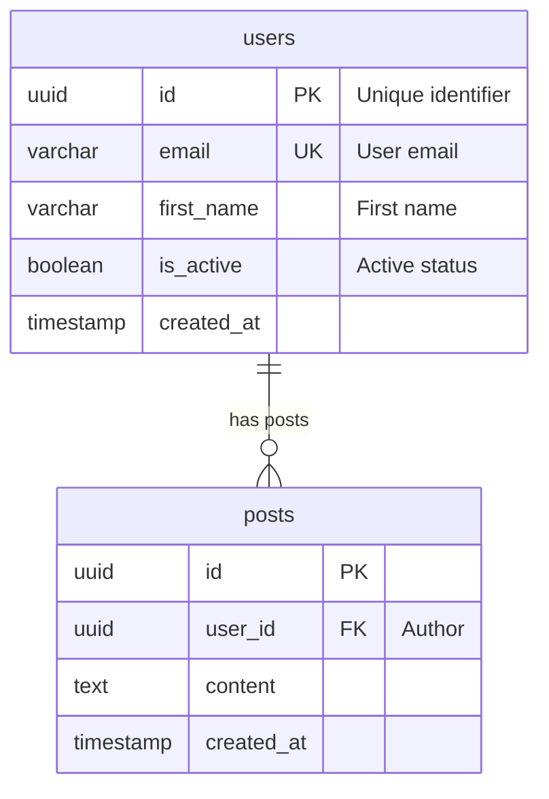

# DeclareAPI Agent

AI-powered agent for generating DeclareAPI configurations from ER diagrams.

## Overview

DeclareAPI Agent is a CLI tool that generates:
- **declareapi.yaml** - DeclareAPI configuration file with CRUD endpoints
- **init.sql** - PostgreSQL DDL script with tables, indexes, and constraints

From Mermaid ER diagrams.

## Installation

### From GitHub Packages (Recommended)

```bash
# 1. Authenticate with GitHub Packages (one-time setup)
dotnet nuget add source "https://nuget.pkg.github.com/TechbuilderIT/index.json" \
  --name "github-techbuilder" \
  --username YOUR_GITHUB_USERNAME \
  --password YOUR_GITHUB_PAT

# 2. Install the tool
dotnet tool install --global DeclareAPI.Agent --source "github-techbuilder"
```

> **Note:** You need a GitHub Personal Access Token (PAT) with `read:packages` scope.
> Create one at: https://github.com/settings/tokens

### From Source

```bash
cd DeclareAPI.Agent
dotnet build
dotnet pack
dotnet tool install --global --add-source ./src/DeclareAPI.Agent.CLI/nupkg DeclareAPI.Agent
```

### Update

```bash
dotnet tool update --global DeclareAPI.Agent --source "github-techbuilder"
```

## Quick Start

```bash
# Check if Ollama is available (optional, for AI-enhanced generation)
declareapi-agent check

# Run interactive wizard
declareapi-agent generate

# Or provide input directly
declareapi-agent generate --input er-diagram.mermaid --output ./output
```

## Usage

### Interactive Wizard

The default mode guides you through:
1. Selecting input ER diagram file
2. Configuring project settings
3. Selecting entities to include
4. Previewing and confirming output
5. Generating files

```bash
declareapi-agent generate
```

### Non-Interactive Mode

```bash
declareapi-agent generate \
  --input ./diagram.mermaid \
  --output ./generated \
  --project MyAPI \
  --no-ai \
  --force
```

### Options

| Option | Short | Description |
|--------|-------|-------------|
| `--input` | `-i` | Input ER diagram file (Mermaid format) |
| `--output` | `-o` | Output directory (default: ./output) |
| `--project` | `-p` | Project name |
| `--model` | `-m` | Ollama model for AI enhancement |
| `--ollama-url` | | Ollama server URL (default: http://localhost:11434) |
| `--no-ai` | | Skip AI enhancement, use rules only |
| `--wizard` | `-w` | Run in interactive mode (default: true) |
| `--force` | `-f` | Overwrite existing files |

## Supported ER Diagram Format

The agent parses Mermaid ER diagrams:



### Supported Types

- `uuid` - UUID primary keys
- `varchar(n)` - Limited strings
- `text` - Unlimited text
- `integer`, `bigint` - Numbers
- `numeric`, `decimal` - Decimals
- `boolean` - True/false
- `timestamp` - Date/time
- `date` - Date only
- `jsonb` - JSON data
- `text[]` - Text arrays
- `inet` - IP addresses

### Constraints

- `PK` - Primary key
- `FK` - Foreign key
- `UK` - Unique key
- `FK_UK` - Foreign key + unique (1:1 relationships)

### Relationships

- `||--o{` - One to many
- `||--o|` - One to zero or one
- `||--||` - One to one (required)
- `}o--o{` - Many to many

## AI Enhancement (Optional)

With Ollama running locally, the agent can use AI to:
- Suggest appropriate filters for list endpoints
- Generate more sophisticated validation rules
- Create optimized SQL indexes

### Recommended Model

Based on benchmarks with RTX 3050 6GB VRAM:

| Model | Quality | Speed | Recommendation |
|-------|---------|-------|----------------|
| **qwen2.5-coder:3b** | **96/100** | **63.7 tok/s** | **Best choice** |
| qwen2.5:7b | 97/100 | 19.5 tok/s | Best quality (slower) |
| mistral:7b | 95/100 | 23.7 tok/s | Alternative |

See [benchmark-ollama-models.md](../documentos_auxiliares/benchmark-ollama-models.md) for details.

### Installation

```bash
# Install Ollama (Windows: download from https://ollama.ai)
curl https://ollama.ai/install.sh | sh

# Pull recommended model (1.9 GB, fits in 6GB VRAM)
ollama pull qwen2.5-coder:3b

# Check availability
declareapi-agent check
```

## Generated Output

### declareapi.yaml

```yaml
version: "1.0"

database:
  provider: postgresql
  connection: "${DB_CONNECTION}"

settings:
  base_path: /api
  default_page_size: 25
  max_page_size: 100

entities:
  Users:
    endpoints:
      list:
        method: GET
        path: /users
        source:
          type: table
          name: users
        filters:
          - { field: email, operator: contains }
        paginated: true
      get:
        method: GET
        path: /users/{id}
        # ...
```

### init.sql

```sql
-- Enable UUID generation
CREATE EXTENSION IF NOT EXISTS "pgcrypto";

CREATE TABLE users (
    id UUID PRIMARY KEY DEFAULT gen_random_uuid(),
    email VARCHAR(255) NOT NULL UNIQUE,
    first_name VARCHAR(100),
    is_active BOOLEAN DEFAULT true,
    created_at TIMESTAMP WITH TIME ZONE DEFAULT NOW() NOT NULL,
    updated_at TIMESTAMP WITH TIME ZONE DEFAULT NOW() NOT NULL
);

CREATE INDEX idx_users_email ON users(email);
CREATE INDEX idx_users_created_at ON users(created_at DESC);
```

## Development

```bash
# Build
cd DeclareAPI.Agent
dotnet build

# Run tests
dotnet test

# Run from source
cd src/DeclareAPI.Agent.CLI
dotnet run -- generate --input ../../examples/er-diagram.mermaid
```

## Project Structure

```
DeclareAPI.Agent/
├── src/
│   ├── DeclareAPI.Agent.Core/       # Models and abstractions
│   ├── DeclareAPI.Agent.Parsers/    # Mermaid ER parser
│   ├── DeclareAPI.Agent.AI/         # Ollama integration
│   ├── DeclareAPI.Agent.Generators/ # YAML and SQL generators
│   ├── DeclareAPI.Agent.CLI/        # CLI application
│   └── DeclareAPI.Agent.Tests/      # Unit tests
└── README.md
```

## License

MIT
